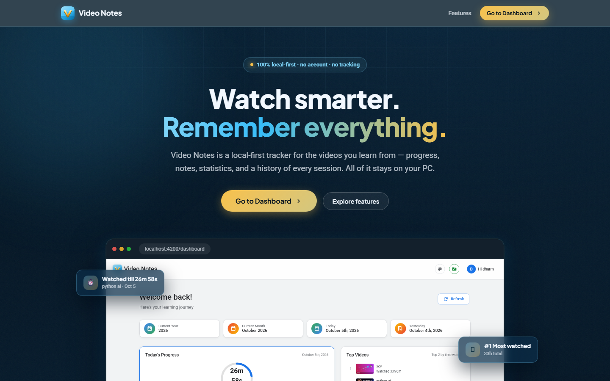
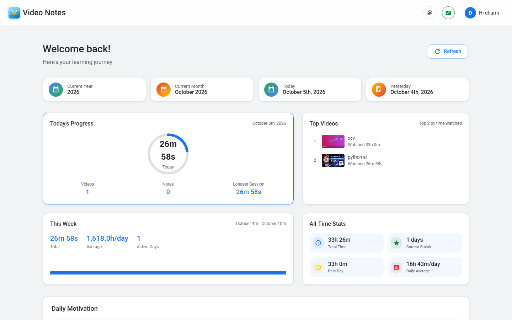
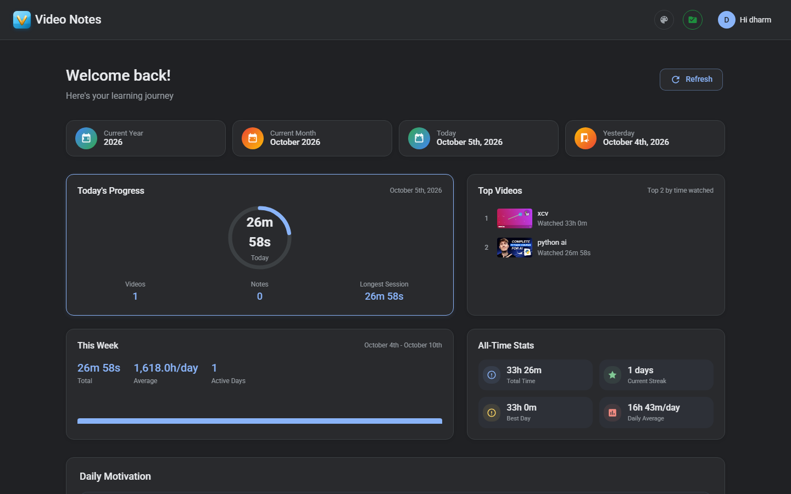
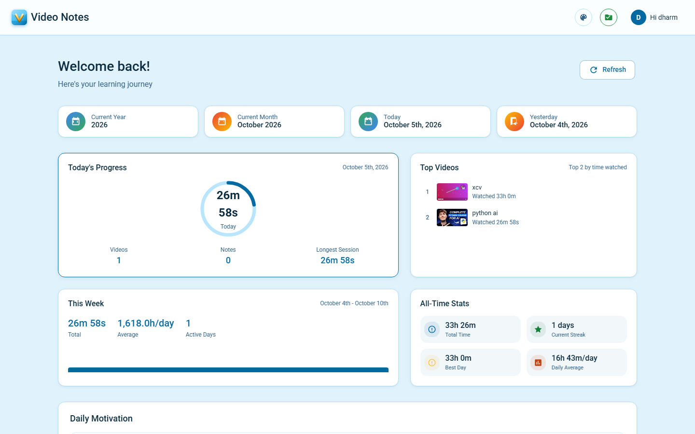
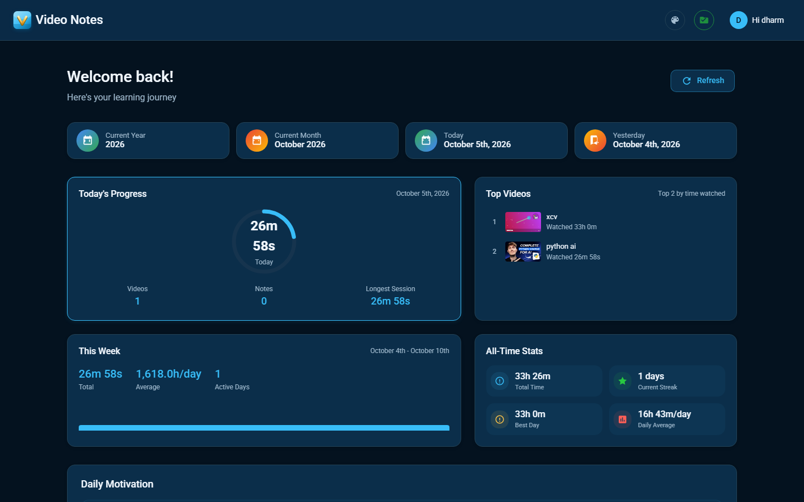
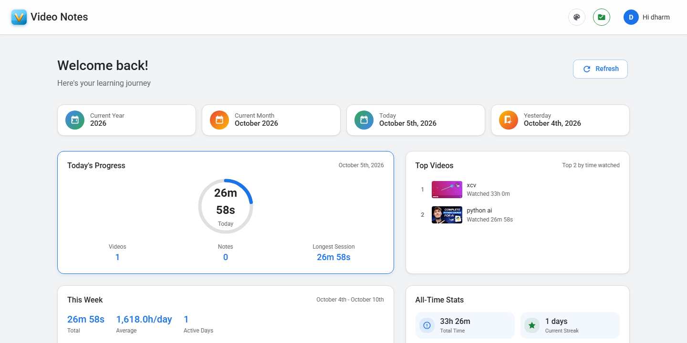
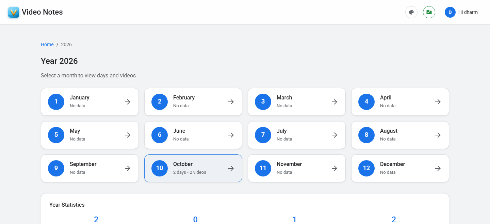
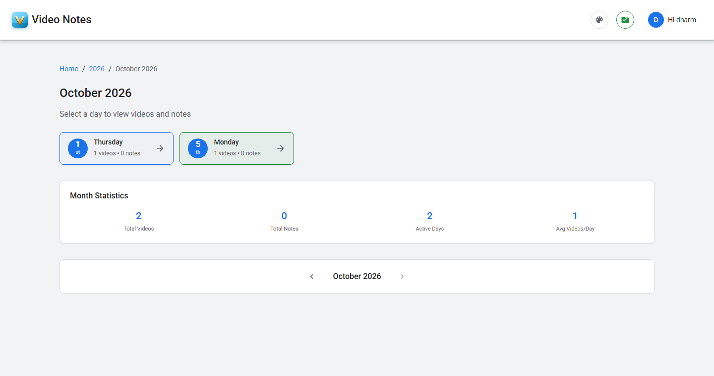
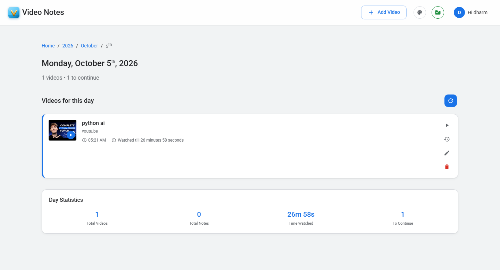
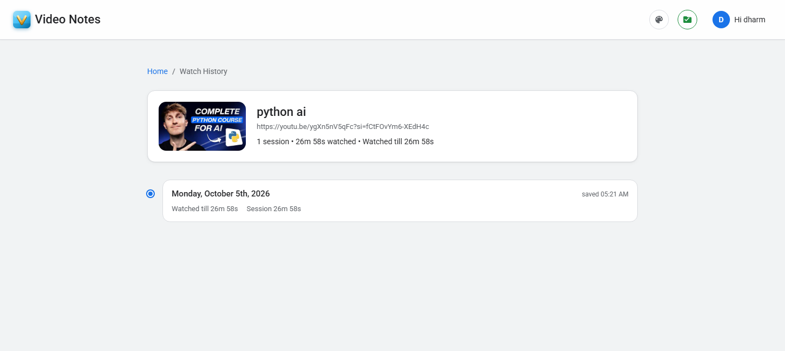

# Video Notes

A local-first web app for tracking the videos you watch and the notes you take while watching them — organized by year, month, and day, with watch progress, a most-watched leaderboard, per-video watch history, and 4 color themes.

Everything runs on your machine. No account, no cloud, no tracking.



## Features

- 🔒 **100% local-first** — no account, cloud, or tracking
- 🎥 **Video tracking** — YouTube and arbitrary video URLs, with real YouTube thumbnails
- 📝 **Notes** — save notes alongside videos
- ⏱️ **Watch progress** — resume from where you stopped
- 📊 **Watch statistics** — daily, weekly, and all-time stats
- 🏆 **Top Videos** — leaderboard of your most-watched videos
- 📅 **Calendar history** — year → month → day navigation
- 🕐 **Per-video history** — track every session for a video
- 🎨 **4 themes** — Light, Dark, Light Version 2, and Dark Version 2

## Screenshots

### Themes

| Light | Dark |
| --- | --- |
|  |  |

| Light Version 2 | Dark Version 2 |
| --- | --- |
|  |  |

### Dashboard


### Year View


### Month View


### Day View


### Watch History


## Getting started

Requires [Node.js](https://nodejs.org/) (LTS version recommended).

```bash
npm install
npm start
```

`npm start` launches both the app and its local data server, then opens `http://localhost:4200/` (the dev server picks a port if 4200 is taken).

Useful commands:

| Command | What it does |
| --- | --- |
| `npm start` | Starts the data API (`server.js`) and the Angular dev server together |
| `npm run api` | Starts only the data API on port 3000 |
| `npm run serve` | Starts only the Angular dev server (needs the API for saving) |
| `npm run build` | Builds the app into `dist/` |

Note: if you only run `npm run serve` without the API, saving fails silently — always use `npm start`.

## Where your data is saved

All data lives in plain files on your own PC, in the `notes/` folder next to `server.js`:

```
notes/
├── video-notes.json   # all your video notes (one line per day)
├── user.json          # your name
├── theme.json         # your selected color theme
└── README.txt         # short note about this folder
```

- The local API (`server.js`) reads and writes these files automatically as you use the app — no setup or folder picker needed.
- Every save is written atomically (temp file + rename), so a crash mid-save can't corrupt your data.
- `video-notes.json` is formatted for humans: each day sits on its own line, so you can read or hand-edit it in any editor.
- The folder-picker button in the header is only a fallback for browsers supporting the File System Access API when the API server isn't running; Chrome may also keep a copy in the folder you pick.
- These files are personal data and are excluded from git via `.gitignore`.

## Tech stack

- [Angular 19](https://angular.dev/) (standalone components)
- Zero-dependency Node.js persistence API (`server.js`)
- SCSS with a CSS-variable theme system

## License

MIT License. See [LICENSE](LICENSE) for details.
